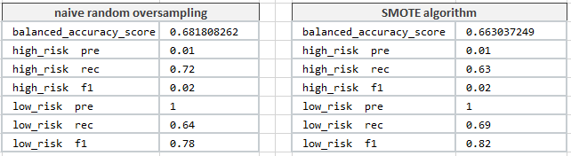

### Module-17-Challenge

ANALYSIS

Dataset contains information on loan application.

Refer to credit_risk_resampling_N.ipynb file. 

##1.1 Oversampling on the dataset using two oversampling algorithms - naive random oversampling algorithm and the SMOTE algorithm.

As illustrated in the table below the balanced_accuracy_score of random oversampling algorithm equals to 0.6818082620937491 while the same score of SMOTE algorithm is 0.6630372491178023.

##1.2 ghj
Instantiated the ClusterCentroids resampling moduleI.

##1.3 gfhj

##1.4

While resampling can attempt to address imbalance, it does not guarantee better results.
