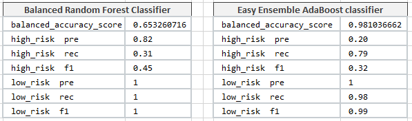

### Module-17-Challenge

ANALYSIS

Dataset in LoanStats_.2019Q1.csv file contains information on 115.675 loans.

Refer to credit_risk_resampling_N.ipynb file for implementation of over- and under- sampling techniques. 
A LogisticRegression model has been used to generate predictions.

## 1. Oversampling on the dataset - naive random oversampling algorithm and the SMOTE algorithm.
As illustrated in the table below the balanced_accuracy_score of random oversampling algorithm equals to 0.682 and it is better than the score of SMOTE algorithm of 0.663.
The high risk precision of 0.01 is very law in both models and recall is better for naive random oversampling algorithm.

## 2. Cluster Centroids resampling
This undersampling model has lower metrics in comparison to oversampling algorithms as shown in the table below: 
the balanced_accuracy_score of 0.544, high risk recall of 0.67 (slightly better than in SMOTE algorithm) and the same high risk precision of 0.01.

## 3. A combination over- and under-sampling algorithm (SMOTEENN) 

It was tested to determine if the algorithm results in the best performance compared to the other sampling algorithms above.

Resampling with SMOTEENN results some better metrics than undersampling model.
While resampling can attempt to address imbalance, it does not provide better results.

To summarize, the resampling techniques such as SMOTE, Cluster Centroids and SMOTEENN do not have favourably distinguished outcome. The high risk precision resulting in every of these algorithms is equal to 0.01 which is not acceptable for  decision making.

## 4. Balanced Random Forest Classifier and an Easy Ensemble AdaBoost classifier 

Two ensemble models were implemented to determine which algorithm results in the best performance. Refer to credit_risk_ensemble_N.ipynb file for evaluation of models. 
The following table shows the comparison of the core metrics.

Random Forest Classifier provides the best result. Although the balanced_accuracy_score of 0.653 is lower vs 0.981, the same score of Easy Ensemble AdaBoost classifier, it shows the highest score in high risk precision of 0.82. That indicates an reliable positive classification. 
The recall of 0.31 is quite low for the high risk loans, which is indicative of a large number of false negatives. However the F1 score of 0.45 resulted with Random Forest Classifier is higher than F1 score with AdaBoost classifier of 0.32.

The random forest model is good at classifying high risk loans because the model’s accuracy of 0.82 and F1 score are high.
Recommendation. Random Forest Classifier should be used to predict credit risk.
